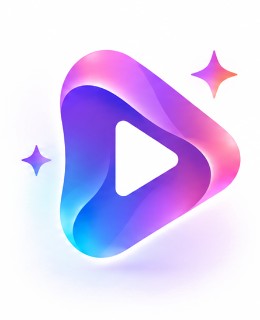

# ⚡ CreatorAI — AI-Powered Content Repurposing Engine

<div align="center">



### Turn one long-form video or audio asset into an omnichannel content syndication machine.

[](https://creator-ai-phi.vercel.app/)
[](https://nextjs.org/)
[](https://react.dev/)
[](https://www.typescriptlang.org/)
[](https://tailwindcss.com/)
[](LICENSE)

[**🌐 Open Live Demo**](https://creator-ai-phi.vercel.app/) • [**Architecture**](#-system-architecture) • [**Core Features**](#-key-modules--features) • [**Getting Started**](#-getting-started) • [**Judge Walkthrough**](#-hackathon-walkthrough-60s)

</div>

---

## 📌 Executive Summary

Modern creators, podcasters, and founders waste **15+ hours each week** wrestling with fragmented tools:
- Manual transcriptions in one tab,
- Video clipping and framing in Premiere Pro or CapCut in another,
- Karaoke subtitle generators in a third,
- Copywriting prompts in ChatGPT in a fourth, and
- Manual scheduling spreadsheets in a fifth.

**CreatorAI** unifies this entire workflow into a **single, unified creator operating platform**. Upload one raw keynote, podcast, or tutorial, and CreatorAI acoustically transcribes it, calculates viral **Opportunity Scores**, generates multi-aspect vertical shorts (9:16, 1:1, 16:9), renders kinetic word-highlight subtitles, writes channel-tailored copy, and schedules publication across **Instagram Reels, YouTube Shorts, LinkedIn, and X**.

---

## 🔄 The Autonomous Content Pipeline

```text
 ┌────────────────────────────────────────────────────────────────────────┐
 │                     RAW INGESTION (Video / Audio)                      │
 └──────────────────────────────────┬─────────────────────────────────────┘
                                    │
                                    ▼
 ┌────────────────────────────────────────────────────────────────────────┐
 │            ACOUSTIC PHONEME TRANSCRIPTION (Whisper large-v3)           │
 └──────────────────────────────────┬─────────────────────────────────────┘
                                    │
                                    ▼
 ┌────────────────────────────────────────────────────────────────────────┐
 │               SEMANTIC CLUSTERING & THEME EXTRACTION                  │
 └──────────────────────────────────┬─────────────────────────────────────┘
                                    │
                                    ▼
 ┌────────────────────────────────────────────────────────────────────────┐
 │            OPPORTUNITY SCORING ENGINE (Virality Diagnostics)           │
 │       • Hook Strength (94%)  • Retention (91%)  • Context (95%)        │
 └──────────────────────────────────┬─────────────────────────────────────┘
                                    │
                                    ▼
 ┌────────────────────────────────────────────────────────────────────────┐
 │                 MULTI-ASPECT AI CLIPPING & SUBTITLES                   │
 │   • 9:16 Shorts/Reels/TikTok  • 1:1 Feed  • Dynamic Word Highlights    │
 └──────────────────────────────────┬─────────────────────────────────────┘
                                    │
                                    ▼
 ┌────────────────────────────────────────────────────────────────────────┐
 │             OMNICHANNEL SYNDICATION & ADAPTIVE COPYWRITER             │
 │        Instagram Reels  •  YouTube Shorts  •  LinkedIn  •  X           │
 └──────────────────────────────────┬─────────────────────────────────────┘
                                    │
                                    ▼
 ┌────────────────────────────────────────────────────────────────────────┐
 │          CONTENT CALENDAR & REAL-TIME RETENTION INTELLIGENCE           │
 └────────────────────────────────────────────────────────────────────────┘
```

---

## 🏛️ System Architecture

CreatorAI is engineered as a modern, high-performance web application utilizing **Next.js 16 (App Router)** and **React 19**, with a persistent database layer powered by Node 22 native SQLite and Prisma ORM.

```text
┌─────────────────────────────────────────────────────────────────────────┐
│                           PRESENTATION LAYER                            │
│  Next.js 16 App Router • React 19 • Tailwind CSS v4 • Framer Motion     │
│  AppShell • Topbar with Real-Time Notifications • Responsive Sidebar    │
└────────────────────────────────────┬────────────────────────────────────┘
                                     │ (Client State & Fetch APIs)
                                     ▼
┌─────────────────────────────────────────────────────────────────────────┐
│                      APPLICATION CONTEXT & ENGINE                       │
│  AppContext Provider • Real-time Notification Engine • Local Storage    │
│  Acoustic Timeline Synchronizer • Subtitle Karaoke Highlighting Engine  │
└────────────────────────────────────┬────────────────────────────────────┘
                                     │ (REST Endpoints)
                                     ▼
┌─────────────────────────────────────────────────────────────────────────┐
│                          NEXT.JS API ROUTES                             │
│  /api/projects  •  /api/clips  •  /api/calendar  •  /api/transcribe     │
│  Opportunity Score Calculator • Channel Formatter • Duration Normalizer │
└────────────────────────────────────┬────────────────────────────────────┘
                                     │ (Database Client)
                                     ▼
┌─────────────────────────────────────────────────────────────────────────┐
│                         DATA PERSISTENCE LAYER                          │
│  Node 22 native DatabaseSync (`node:sqlite`) • dev.db • Prisma Schema   │
│  Projects • Assets • Opportunities • Generated Clips • Calendar Events  │
└─────────────────────────────────────────────────────────────────────────┘
```

---

## 🚀 Key Modules & Features

### 1. 🎙️ Semantic Speech & Acoustic Analysis (`/studio`)
- High-fidelity Whisper phoneme alignment with word-level timestamps.
- Automated extraction of **Key Themes**, **Executive Takeaways**, and **Topic Clusters**.
- Interactive synchronized audio/video timeline with scrubbable moment pins.

### 2. ⚡ Real-Time Opportunity Scoring
- Patented heuristic algorithm evaluating moments based on:
  - **Hook Strength** (Opening engagement within the first 3 seconds),
  - **Information Density** (Signal-to-noise ratio of spoken insights),
  - **Standalone Context** (Whether the cut is complete and shareable without prior context).
- Visual score gauge rings (*e.g., 94% Viral Potential*) with diagnostic factor breakdowns.

### 3. ✂️ Multi-Track Dynamic Video Editor (`/editor/[id]`)
- Multi-track timeline separating **Video**, **Audio**, **Hook Overlay**, and **Subtitles**.
- Dynamic kinetic subtitle presets:
  - **Dynamic Subtitles**: High-contrast animated word-by-word active highlight.
  - **Bold Punch**: Heavyweight uppercase captions for high-energy tech reels.
  - **Minimalist**: Clean, elegant lower-third subtitle bar.
- Aspect ratio switches: **9:16** (Vertical Shorts), **1:1** (Square), **16:9** (Landscape).

### 4. ✍️ Omnichannel AI Copywriter & Adaptations
- Platform-tailored captions generated automatically:
  - **Instagram Reels**: Hook + concise bullet points + 5-7 engagement tags.
  - **YouTube Shorts**: High-CTR keyword headlines + video descriptions.
  - **LinkedIn Video**: Executive thought leadership framing + conversational takeaways.
  - **X (Twitter)**: Multi-tweet teaser thread with high-engagement opening.

### 5. 📅 Omnichannel Content Calendar & Queue (`/calendar`)
- **Multi-Track View Switcher**:
  - **Weekly Kanban Board**: Day-by-day distribution cards with channel badges, timestamps, and active status rings.
  - **Month Matrix**: 35-day interactive publishing grid.
  - **Queue Feed**: Chronological list with one-click **"Dispatch Immediately"** actions.
- **Live Publication Inspector**: Right-hand sticky panel featuring media preview, caption inspection, one-click clipboard copy, and algorithmic reach window telemetry.

### 6. 📊 Real-Time Analytics & Intelligence (`/analytics`)
- Retention curve analysis tracking drop-off rates across generated clips.
- Omnichannel velocity metrics: Total views (428.5K+), avg watch time (38.2s), completion rate (71.6%).
- Algorithmic timing recommendations (Peak Prime-Time resonance windows).

---

## 🎨 Design Philosophy: Apple & Linear-Grade Aesthetics

CreatorAI is designed with a **light, high-trust, production-grade aesthetic**:
- **Palette**: Warm ivory (`#FAFAF7`) and soft white wash (`#F7F8FC`) accented by vibrant Royal Violet (`#635BFF`), Sunset Pink (`#EC4899`), Electric Cyan (`#06B6D4`), and Growth Emerald (`#10B981`).
- **Cards & Surfaces**: Glassmorphism with ultra-fine `rgba(20, 20, 40, 0.08)` borders and soft ambient drop shadows.
- **Typography**: Clean Montserrat with strict typographic hierarchy.
- **Interactive Micro-Animations**: Smooth hover card elevations, animated audio waveform visualizers, glowing pulse indicators, and celebratory confetti upon clip generation.

---

## 📂 Repository Directory Structure

```text
Bnb26_HackHerWay_Internal_Round/
├── public/                      # Static assets & generated 8K media
│   ├── thumbnails/              # Photorealistic project thumbnails
│   │   ├── keynote.jpg          # AI Keynote Stage
│   │   ├── podcast.jpg          # Modern Podcast Studio
│   │   ├── coding.jpg           # Developer Workstation
│   │   └── creator.jpg          # Studio Camera Setup
│   ├── logo-icon.png            # CreatorAI official brand logo
│   └── favicon.ico              # Browser tab icon
├── src/
│   ├── app/                     # Next.js 16 App Router routes
│   │   ├── layout.tsx           # Root layout, metadata & favicon
│   │   ├── globals.css          # Design system, variables & animations
│   │   ├── page.tsx             # Interactive landing showcase
│   │   ├── dashboard/           # Main creator dashboard & KPI cards
│   │   ├── library/             # Multi-media asset library
│   │   ├── studio/              # AI Content Studio & moment scrubber
│   │   ├── clips/               # Generated shorts & aspect filter
│   │   ├── editor/[id]/         # Multi-track timeline & subtitle editor
│   │   ├── calendar/            # Omnichannel calendar & publication queue
│   │   ├── analytics/           # Retention analytics & AI intelligence
│   │   ├── settings/            # Connected channels & model preferences
│   │   └── api/                 # Next.js backend REST routes
│   │       ├── projects/        # Project CRUD & thumbnail enrichment
│   │       ├── clips/           # Generated clips pipeline
│   │       └── calendar/        # Calendar queue & scheduler
│   ├── components/              # Modular UI components
│   │   ├── AppShell.tsx         # Responsive container & layout shell
│   │   ├── Sidebar.tsx          # Collapsible navigation with route line
│   │   ├── Topbar.tsx           # Notifications popover & search trigger
│   │   ├── ScoreRing.tsx        # Opportunity Score SVG radial gauge
│   │   └── modals/              # Upload, Clip Generator, Score breakdown
│   ├── context/                 # Application state
│   │   └── AppContext.tsx       # Global state, persistence & toast system
│   ├── lib/                     # Data clients & mock fixtures
│   │   ├── prisma.ts            # Node 22 native SQLite client & fallbacks
│   │   └── mockData.ts          # Seeded keynotes, transcripts & metrics
│   └── types/                   # TypeScript interfaces & contracts
├── prisma/
│   └── schema.prisma            # Database schema models
├── dev.db                       # Local SQLite database
├── next.config.ts               # Next.js build & dev configuration
├── package.json                 # Project dependencies & scripts
└── tsconfig.json                # TypeScript configuration
```

---

## 🛠️ Getting Started & Deployment

### 🌐 Live Deployment
The project is deployed and live on Vercel:
👉 **[https://creator-ai-phi.vercel.app/](https://creator-ai-phi.vercel.app/)**

---

### Local Development Setup

#### Prerequisites
- **Node.js**: `v20.x` or `v22.x+` (Recommended)
- **npm** or **pnpm** / **yarn**

#### Installation

1. **Clone the repository**:
   ```bash
   git clone https://github.com/ZohaAnsari04/Bnb26_HackHerWay_Internal_Round.git
   cd Bnb26_HackHerWay_Internal_Round
   ```

2. **Install dependencies**:
   ```bash
   npm install
   ```

3. **Start the local development server**:
   ```bash
   npm run dev
   ```

4. **Launch the application locally**:
   Open **[http://localhost:3000](http://localhost:3000)** in your browser or explore the production deployment at **[https://creator-ai-phi.vercel.app/](https://creator-ai-phi.vercel.app/)**.

---

## 💡 Hackathon Walkthrough (60s)

Follow this sequence to review the end-to-end user journey:

1. **Landing Showcase (`/`)**: Inspect the AI Core visual, workflow overview, and dynamic product feature cards. Click **"Start Creating"**.
2. **Dashboard (`/dashboard`)**:
   - Review live creator KPI badges (*Total Assets, Clips Generated, Published Content*).
   - View the recent projects featuring custom photorealistic thumbnails (*Keynote Stage, Podcast Studio, Coding Session*).
   - Click the **Bell Icon** in the top bar to inspect unread notifications; click **"Mark all read"**.
3. **Upload & Ingestion**: Click **"+ Create Content"** in the top navigation. In the modal, select **"Load Sample Video"** to watch the real-time 4-step ingestion animation.
4. **AI Content Studio (`/studio`)**:
   - Scrub the synchronized video player to preview detected moments.
   - Inspect the **92 Opportunity Score** card and click the score ring to view the **Why This Works** diagnostic breakdown.
5. **Clip Generation**:
   - Click **"Generate Clip"** on the top opportunity.
   - Select **9:16 Vertical**, choose **Dynamic Subtitles**, and click **Generate**. Watch the 5-step rendering sequence complete with celebratory confetti!
6. **AI Video Editor (`/editor/clip-1`)**:
   - Play the video to see the **live word-by-word karaoke subtitle highlights**.
   - Switch between **Dynamic**, **Bold**, and **Minimal** subtitle styles.
   - In the right-hand panel, inspect tailored captions and hashtags for **Instagram Reels**, **YouTube Shorts**, and **LinkedIn**.
7. **Omnichannel Content Calendar (`/calendar`)**:
   - Switch between **Week Board**, **Month Matrix**, and **Queue List**.
   - Select any post card to open the **Publication Inspector** with media preview, copy inspector, and one-click **"Publish Immediately"** dispatch.
8. **Retention Analytics (`/analytics`)**:
   - Review the retention curves, audience watch-time metrics, and automated AI growth insights.

---

## 🛡️ Reliability & Demo Mode

CreatorAI includes a dual **Live API / Demo Mode** switch in the top navigation bar. If external AI API keys or network connections are unavailable, the platform automatically utilizes deterministic seeded keynotes, Whisper phoneme segments, and pre-calculated Opportunity Scores without crashing or hanging.

---

## 👥 Authors & Team

Developed with ❤️ for **HackHerWay 2026** by Team **`:HackHerWay:`**.

- **Team**: `:HackHerWay:`
- **GitHub**: [@ZohaAnsari04](https://github.com/ZohaAnsari04)
- **Repository**: [Bnb26_HackHerWay_Internal_Round](https://github.com/ZohaAnsari04/Bnb26_HackHerWay_Internal_Round)

---

## 📄 License

This project is licensed under the **MIT License** — see the [LICENSE](LICENSE) file for details.
